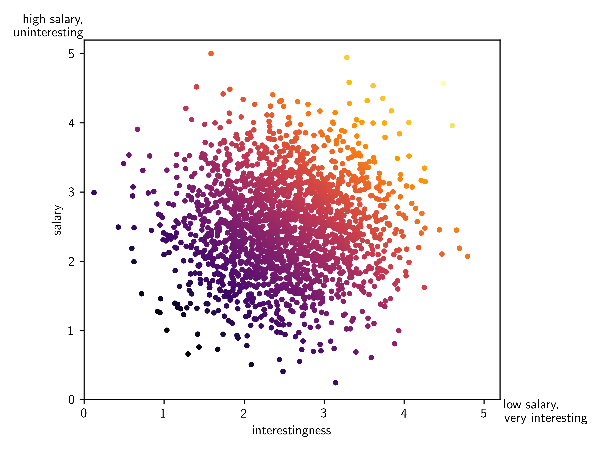

here's a little shower thought [^pgen].

imagine a simple, fair and meritocratic parallel universe where you are judged solely by the following metrics when applying for a job:

- your education: your degrees and certificates
- your experience: the number of years you worked in the field
- the reputation of institutions you worked for and studied at: different rankings and ratings
- your skills: your technical and soft skills based on some standardized tests

and nothing else.

of course this is far from reality. human judgement is flawed and biased. it's impossible to quantify how suitable a person is for a job – otherwise human resources departments would be obsolete and people would hire algorithmically.

but that's exactly the case here.

in this parallel universe, there is a "job market score" that is calculated based on these metrics and a perfect indicator for how suitable you are for a job.

this means that jobs are assigned purely based on supply, demand and your score:

- lower demand for a profession = higher competition for employment
- higher demand for a profession = lower competition for employment

but the demand for a profession doesn't influence the pay or complexity of the job.

we assume that the best paying jobs are:

- the most complex (require the highest education, experience, skills)
- the highest in demand

we also assume that humans are utilitarian, rational, self-interested and just want to maximize their earnings. these humans are not picky about the job they get, as long as it pays well. a lawyer would be just as happy working as a plumber if the pay is better, even if it's less prestigious, exciting or involves physical labor.

how would you game this system?

well - simply by taking the path of least resistance: finding the highest paying job at reach and fulfilling the minimum requirements.

  

# reality check

so why doesn't this happen in the real world?

because people also try to find personal fulfillment, happiness, excitement, prestige, etc. in their jobs.

what about you? what are you optimizing for? what are you willing to sacrifice to get it? finding your personal fit is a complex topic.

- a) if you're optimizing for compensation, you should avoid competition by doing something in high demand that most people avoid (ie. blue collar jobs, cobol programming).

- b) if you're optimizing for personal fulfillment, you can avoid competition by delaying your earnings (ie. by studying for a phd, working for a non-profit).

your personal fit is a combination of the following components [^fitdump]:

- career capital = skills, connections, credentials.
- impact = solving important problems with the right methods. your job satisfaction will grow over time as you get better and others start appreciating you more.
- supportive conditions = engagement, colleagues, basic needs.
- personal fit = how well it fits you (this is like a multiplier to the sum of the components above).

based on 80,000 hours' career reviews [^demanddump], the most impactful jobs are mostly in the following fields:

- **data & statistics:** machine learning, statistical modeling, forecasting, data based decision governance, ai alignment, explainability, fairness, privacy, security, ethics, etc.
- **cyber security:** privacy, integrity, availability, confidentiality, etc.
- **computer engineering:** especially for ai hardware
- **geopolitics, governance:** policy, regulation, law, etc.
- **biosecurity:** preventing, detecting, responding to biological threats

also here's my sketch of the same concept (with a little more detail – but don't take it too seriously):

  

# footnotes

personal fit:

- https://80000hours.org/career-guide/personal-fit/
- https://80000hours.org/2022/06/know-what-youre-optimising-for/
- https://80000hours.org/2020/02/anonymous-answers-general-life-advice/
- https://80000hours.org/2020/01/anon-answers-one-way-successful/
- https://80000hours.org/2019/11/anonymous-answers-personal-reflections/
- https://80000hours.org/2019/04/career-advice-i-wish-id-been-given-when-i-was-young/
- https://80000hours.org/2019/10/anonymous-advice-careers/

career impact:

- https://80000hours.org/career-reviews/
- https://80000hours.org/skills/software-tech/#specialty

references:

[^pgen]: originally from a video by "the primeagen" called ["Developers On Edge"](https://youtu.be/DOdB1e1xrfU?si=9w5wRToMUhBimeNi&t=828).
[^fitdump]: check out the links above in the "personal fit" section for some interesting articles on this topic.
[^demanddump]: check out the links above in the "career impact" section for some interesting articles on this topic.
