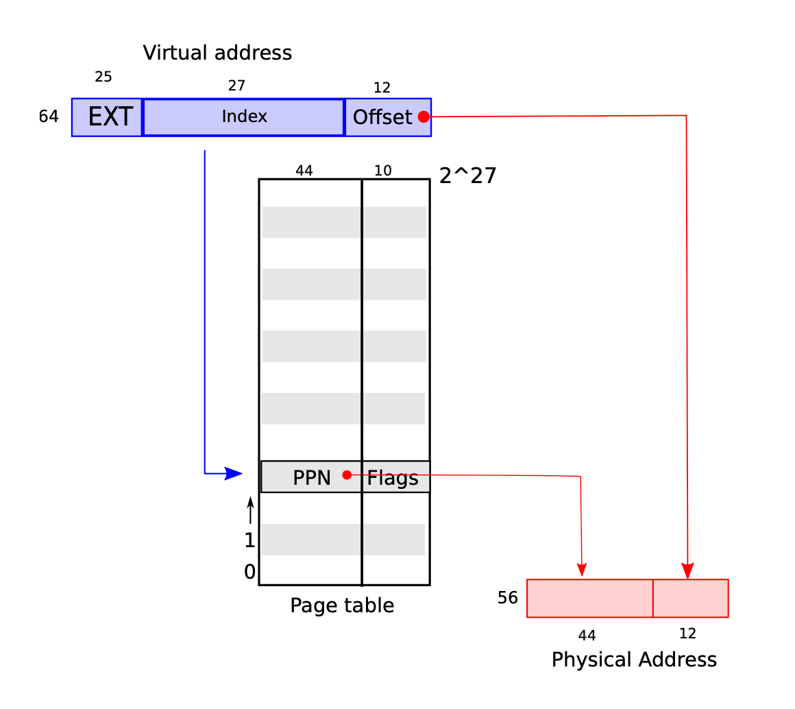

> Cox, Russ, M. Frans Kaashoek, and Robert Morris. "Xv6, a simple Unix-like teaching operating system." 2013-09-05]. http://pdos. csail. mit. edu/6.828/2012/xv6. html (2011).

# xv6 operating system

_chapters_

1. operating system interfaces

      introduction to c, shell, unix

2. operating system organisation

      operating systems

      system call, kernel space, user space

      process, thread

      virtual address, physical address

3. page tables

      virtual memory layout

4. traps and system calls + interrupts and device drivers

      exceptions, interrupts, ecalls

5. locking

      concurrency basics

6. scheduling

      scheduling, context switching, sleep/wakeup

7. file system
8. concurrency revisited

# overview

_kernel privileges_

- machine mode: boot sector, configuring a computer.
- supervisor mode: kernel space, disabling interrupts, reading and writing into special registers.
- user mode: user space applications. the applications must switch the mode for system calls.
- privileges are managed by riscv:
     - `ecall` raises the privileges
     - `sret` lowers the privileges.

_virtual address space → physical address space (simplified version of sv39 lp64 riscv)_

- riscv instructions only use virtual-addresses.
- through the riscv page-table these virtual-addresses get mapped to physical-addresss.

     - virtual addresses: have 64 bits. 39/64 bit are used. 27/39 bit point to the right PTE and 12/39 bit are an offset that gets combined with the PPN to point to the physical address.
     - page table entries (PTE): have a 44-bit physical-page-number (PPN) and some flags that help with caching, authorization etc.

- the physical memory pages here are in the DRAM.
- to cache the physical memory a ‘translation look-aside buffer TLB’ is used.
- in xv6 each process has 2 page-tables: one for the user address space, one for the kernel address space.

_kernel address space_

- arguments get passed to kernel through registers in riscv.
- virtual kernel addresses are identical to the physical addresses (except for the trampoline pages and the kernel stack).
- qemu can only emulate the addresses `KERNBASE (0x80000000)` to `PHYSTOP (0x88000000)`.
- everything below is emulated hardware.

_process address space_

- in xv6 the smallest unit of isolation is a process (that has a single thread).
- each process has: an address space to give a process the illusion of its own memory, and, a thread, to give the process the illusion of its own CPU.
- each process has its own private virtual address-space (consisting of multiple pages) with this layout:

     - user data: starts at virtual address 0, contains instructions, global variables.
     - user stack: for function calls and static memory allocations.
     - kernel stack: each process also has a seperate kernel stack used to run system calls.
     - heap: for dynamic memory allocations (malloc).
     - trapframe: saving/restoring the state of the process.
     - trampoline: code to transition into the kernel and back. it’s mapped to several address spaces.

_memory allocation optimizations (not in xv6)_

- copy-on-write (cow) forks

     cow-fork means that child can initially only read physical addresses of parent by sharing them through virtual addresses - but as soon as writing fails, a copy is created for the child.

     sharing virtual copies is faster than actually copying memory.

- lazy allocation

     kernel always gives processes virtual memory when they request more and only allocates a bunch of physical memory when there is a page fault.

- demand paging

     kernel only loads actually virtual pages of the disk that are requested and not everything at once.

- paging to disk

     acting as if there would be more RAM available than there actually is by storing some user-space pages in a ‘paging area’ that’s been ‘paged out to disk’.

     they will be ‘paged in’ on page faults and ‘evict’ other pages to make more space (this is very expensive).

_traps_

- traps interrupt flow (special riscv instructions) to run kernel code to handle an event.

     - `ecall`: elevate privilege for each system call.

     - `exception`: illegal operation in user/kernel space.

          in other systems you’d have cow-forks when ‘page-fault exceptions’ occur.

          - page fault exception types

               a) load page fault: physical address to read can’t be found

               b) store page fault: physical address to write can’t be found

               c) instruction page fault: physical address in program counter can’t be found

     - `device interrupt`: device signals that it needs attention. high cpu overhead so polling is preferred.

          ‘device drivers’ are responsible for managing a particular devices hardware (configure, communicate, handle interrupts).

          they are split up in 2 halves: one half is in the kernel thread of a process and gets called via system calls that request something and the other half runs when there is an interrupt because ie. the device responded.

          when devices transfer lots of data, they use the ‘direct memory access dma’ to write directly into the ram.

- in xv6 traps are processed based on where they’re from:

     - user space: during illegal operations, `ecall` instructions, device interrupts. uses a trampoline page + trapframe.
     - kernel space: already in kernel - just saves state in the kernel-page-stack.
     - timer interrupts: riskv uses these to manage its clock. in xv6 it calls each cpu periodically. must be called in machine mode, completely isolated from the other kernel code and is done by the core-local interruptor (clint) hardware. it even interrupts the kernel. it runs ‘yield’ to swtich processes and share the cpu time fairly.

_concurrency_

- symmetric multiprocessing / shared-memory multiprocessing (SMP): multiple processors that are treated equally and share 1 memory.
- concurrency control techniques: strategies for correctness under concurrency.
- lock/semaphore: for critical sections. only allows one process to access a section at a time.

- there are to kinds of locks in xv6:

     - spinlocks: busy waiting. blocks until operation is possible. `locked` variable is only 0 when lock available. value is set with atomic riscv operation. xv6 disables interrupts on the cpu holding the lock so the flow isn’t disturbed.
     - semaphores: can be built with a spinlock. has a counter.
     - sleeplocks: yields cpu while waiting. xv6 allows interrupts.

- some things to consider about locks:

     - re-entrant-locks

          are special locks that can hold the lock even when calling another function in the stacktrace - but they make it hard to make sure that programs behave correctly

     - memory barriers

          force the cpu not to reorder instructions for optimizations in specific regions

_scheduling_

- xv6 strategy: a yield happens with every hardware timer interrupt (’round robin’ scheduling) but also when waiting for i/o, child to exit, after sleep/wakeup system calls.

- coroutines: thread switching procedures passing control to eachother.

- context switching: from $\small \text p1$ to $\small \text p2$

     1. transition from $\small \text p1$ user-space to $\small \text p1$ kernel-space (system call / interrupt).
     2. context-switch from $\small \text p1$ kernel-space to $\small \text p1$ scheduler-thread.

           xv6 has a thread dedicated just to scheduling.

           the scheduler iterates through the process table.

     3. context-switch from $\small \text p1$ kernel-space to $\small \text p2$ kernel-space.
     4. trap-return to $\small \text p2$ user-space.

- sleep/wakeup: marks the state of a process as `sleeping` or `runnable`.

- if parents never `wait` for their children to exit, then the children stay in the `zombie` state.

_filesystem_

- reperesenting the file-tree, sharing persistent data concurrently among applications and users, caching files from disk, crash recovery.

- the xv6 filesystem has 7 layers:

     - file-descriptor / file

          ‘file’ is a shorthand for ‘file-descriptor’.

          file-descriptors are integers that link to kernel managed objects like files, directories, kernel devices (console, pipe, …).

          each process has own file-descriptor table, containing `FILE` structs that wrap around inodes or pipes with an i/o offset.

          all open files in a system are managed in a global file table.

     - pathname

          hierarchical path names that can be resolved with recursive lookup.

     - directory

          special inode that has a list of files and their i-numbers.

     - inode / index node

          - a) on-disk inodes:

               the inode memory area is splt into blocks that are numbered sequentially - therefore each block has a unique i-number / inode number `ino`.

               each inode block contains: file content sizes, list of data-block numbers for the inode and the lists length, a list of ‘indirect-blocks’ that point to the data-blocks the type (file, directory, kernel device), the number of references (files can be referenced by multiple names called ‘links’) so we know when to free data-blocks.

          - b) in-memory inodes:

               copy of the on-disk inode as well as extra informtion needed for the kernel.

               stored in a kernel table called ‘itable’.

     - logging

          wraps multiple data-block updates into ‘atomic transactions’ in case of a crash.

     - buffer cache

          has a fixed number of buffered blocks.

          caches disk-blocks. evicts least recently used (LRU) block.

          prevents concurrent data access of kernel processes to blocks.

     - disk

          reads and writes disk-blocks into a ‘virtio’ hard drive.

          space on disk is split into 512-byte data-blocks / sectors.

          physical memory layout:

          - boot sector (sector 0)

               read to boot system up.

          - superblock (sector 1)

               contains metadata like the filesystem size, number of data-blocks, number of inodes, number of blocks in the log.

               acreated during the filesystem creation.

          - log (starting from sector 2)

               header block + logged blocks.

               logs every transaction pre commit - marks logs with a ‘commit record’ after finishing the transaction and deletes logs.

               for crash recovery when disk is left in an in an inconsistent state:

               - a) inode with reference to a free block - will cause serious problems after reboot because the kernel could allocate and assign it again to a second file.

               - b) allocated but unreferenced data block

          - inodes

               there are multiple inodes in a single block.

          - bitmap

               track which data-blocks are in use.

          - data

# bonus: boot sector

_boot sector with x86 assembly (see page 27)_

- [https://github.com/mit-pdos/xv6-public/blob/master/bootasm.S](https://github.com/mit-pdos/xv6-public/blob/master/bootasm.S)
- intel wants to keep backwards compatibility so up until the a20 line start you just incrementally use version specific instructions
- then calls the bootmain.c: [https://github.com/mit-pdos/xv6-public/blob/master/bootmain.c](https://github.com/mit-pdos/xv6-public/blob/master/bootmain.c)
- then it initialises everything: [https://github.com/mit-pdos/xv6-riscv/blob/riscv/kernel/main.c](https://github.com/mit-pdos/xv6-riscv/blob/riscv/kernel/main.c)
- `userinit` calls the first process.

# other references

xv6 book: https://pdos.csail.mit.edu/6.828/2023/xv6/book-riscv-rev3.pdf

root: https://pdos.csail.mit.edu/6.828/

_xv6 source code_

- https://github.com/mit-pdos/xv6-riscv.git
- [Tools used](https://pdos.csail.mit.edu/6.828/2023/tools.html)
- [Lab guidance](https://pdos.csail.mit.edu/6.828/2023/labs/guidance.html)

_book exercises_

- [Lab: Xv6 and Unix utilities](https://pdos.csail.mit.edu/6.828/2023/labs/util.html)
- [Lab: System calls](https://pdos.csail.mit.edu/6.828/2023/labs/syscall.html)
- [Lab: page tables](https://pdos.csail.mit.edu/6.828/2023/labs/pgtbl.html)
- [Lab: Traps](https://pdos.csail.mit.edu/6.828/2023/labs/traps.html)
- [Lab: Copy-on-Write Fork for xv6](https://pdos.csail.mit.edu/6.828/2023/labs/cow.html)
- [Lab: Multithreading](https://pdos.csail.mit.edu/6.828/2023/labs/thread.html)
- [Lab: networking](https://pdos.csail.mit.edu/6.828/2023/labs/net.html)
- [Lab: locks](https://pdos.csail.mit.edu/6.828/2023/labs/lock.html)
- [Lab: file system](https://pdos.csail.mit.edu/6.828/2023/labs/fs.html)
- [Lab: mmap](https://pdos.csail.mit.edu/6.828/2023/labs/mmap.html)
