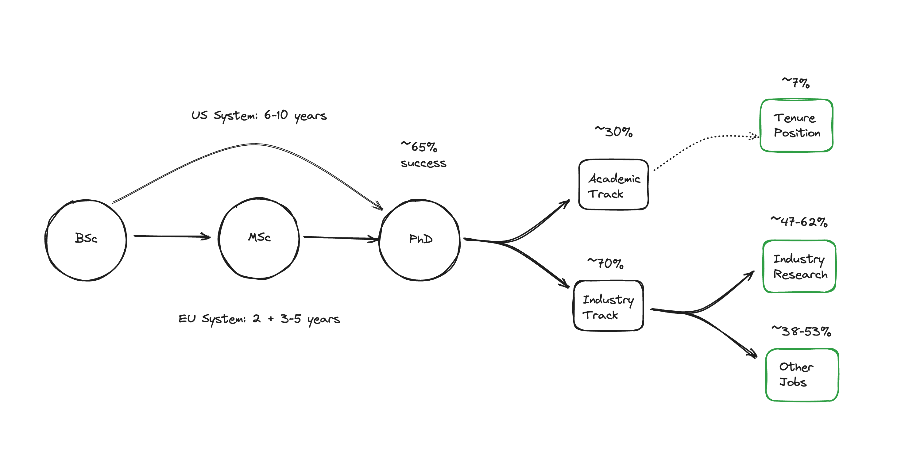
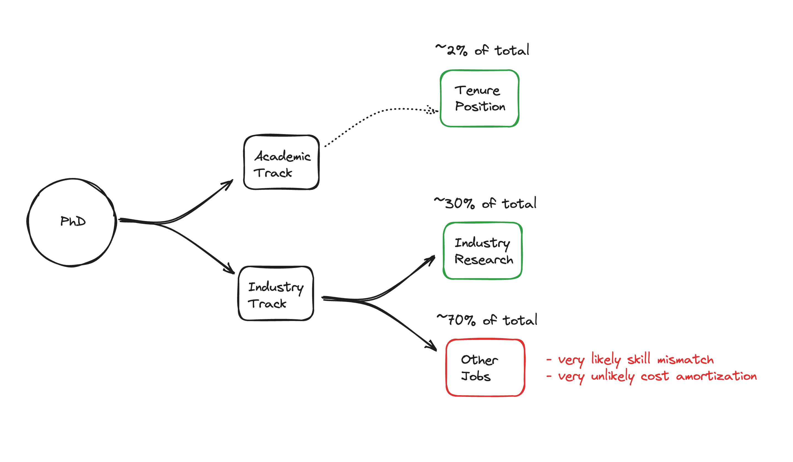

# is a phd really worth it?

it boils down to your definition of success [^1]:

1. **define success on your terms:**

   - set clear goals and metrics, whether it's about your total compensation or personal fulfillment and growth.
   - think outside the box. consider unconventional paths like collaborating with industry or testing business ideas during your phd.

2. **consider opportunity costs:**

   - time and money are crucial factors. years spent in academia could mean missing out on significant paychecks.
   - watch out for overspecialization, and be mindful of the mental strain that academia can bring.

3. **skill vs. luck:**

   - a phd improves your odds but doesn't guarantee success. your experience will vary based on many factors (research field, advisors, institution reputation, and location)
   - remember, success often requires both skill and luck.

4. **be data-driven:**

   - don't base decisions solely on success stories (survivorship bias). look at the bigger picture and consider various data points.

5. **normative vs. positive approaches:**

   - are your decisions driven by societal norms or tangible benefits that you care about?

but success metrics are hard to define:

- **unclear metrics:** many struggle to define what they truly want from their careers amidst societal pressures and assumptions.

- **reluctance to share:** discussing personal metrics can be uncomfortable due to fear of judgment or competitiveness.

- **evolving priorities:** as you gain experience, your priorities shift. what mattered most earlier might not be the same now.

and most of them are even harder to measure.

one commonly considered and easy to measure metric is the potential for compensation growth throughout your career. but that's rarely the reason cs grad students pursue their degree [^2] [^3] [^4].

  

## paths and probabilities

the computing research association's "taulbee survey" [^5] offers key insights into our query:

> “The CRA Taulbee Survey is the principal source of information on the […] employment of Ph.D.s in […] computer science […] and in providing salary […] data […] in North America.“

here are the essential findings:

- **only around 2% secure tenure positions:**

     that is, only 7% of the ~30% that actually pursue an academic career which is equivalent to ~2% of all phds.

     there are very few tenure positions compared to the number of ph.d. holders [^6]. the scarcity of tenure positions persists even as the number of ph.d. graduates increases.

     moreover, the allocation of tenure positions isn’t even across different research fields. it leans towards areas that align better with abstract or better-funded tasks like data analysis, ai, or security. this trend is influenced by several factors, including the school attended [^7], the race and gender [^8] of the individuals. it highlights that research institutions don't solely operate based on merit but are also influenced by politics and nepotism.

     additionally to get a tenure-track assistant professor position it is increasingly necessary to do one or more post-docs first.

     but being on the tenure-track is in no way a guarantee of tenure. you might spend your entire career competing and never secure tenure.

- **around ~30% of ph.d. graduates venture into research roles in the industry:**

     in total (both inside and outside the usa), 69.5% of ph.d. holders pursue careers outside academia, ~38-53% of which are research roles. this means that ~30% of ph.d. graduates venture into research roles in the industry.

     if only ~30% of ph.d. graduates venture into research roles in the industry, then ~70% end up with a skill mismatch.

- **over 65% of ph.d. pursuits might be motivated by immigration:**

     approximately 66.9% of computer science phds were awarded to immigrants or nonresident aliens, suggesting that for many, a ph.d. was a pathway to american citizenship via the o1 visa.

     it's noteworthy that 33.1% of the remaining ph.d. holders are non-immigrants, of which 20.1% are white. this shows that phd programs are surprisingly diverse – which is great or a sign of a broken system, depending on your perspective.

- **completion rates are low – but for the wrong reasons:**

     regarding the completion rate, the data is inconclusive: 35% of computer science students at the university of duke [^9] don't complete their phd program.

     but i personally believe that this is due to the fact that it's significantly easier to get funding for a phd than for a master's degree, which motivates students to plan to master out from the beginning.

     additionally, it's very hard to get kicked out of a phd program. so, i believe that the completion rate of those actually pursuing a phd with the intention of completing their program is much higher.

here's a simplified perspective that also includes the results of the probabilities, assuming they're unconditional:

  

<!--

## salary comparison

finally we try to get some salary data to compare the different paths.

- **median industry earnings:**

     websites like glassdoor and payscale were very wrong about salary information while levels.fyi [^10], one of the most extensive databases available, was very accurate. according to their data from 2022 the median yearly pay for tech jobs is the following:

     - san francisco: $234,000 (1st position)
     - washington d.c.: $148,000 (10th position)
     - overall median ranges from $160,000-$210,000
     - l1 positions at the top-paying faang companies: $220,000-$274,000
     - research scientist positions at the top-paying faang companies: $280,000+ (not enough data)

- **lifelong earnings:**

     the united states census bureau also conducted several surveys.

     in a community survey from 2009-2011[^11] salaries in computers and mathematics were around $73,000 for a bachelor's degree, $90,000 for a master's degree, and $104,000 for a ph.d. but this observation seems to be out of date.

     in another survey[^12] they also studied lifelong earnings. for individuals in computers and mathematics, the following results were found regarding their earnings over their working life (25-64 years, full-time):

     - bachelor's degree: $3,044,000
     - master's degree: $3,541,000
     - ph.d. degree: $3,890,000

     this should be taken with a grain of salt as it's based on a small sample size.

- **r&d earnings (difference unclear):**

     the national center for biotechnology information (ncbi) / national library of medicine (nlm)[^13] found that doctoral recipients from eight universities showed variations in earnings based on where they were employed.

     those placed in industry had significantly higher earnings a year after leaving university compared to those in government or academia.

     when looking at the distribution of earnings, doctoral recipients, particularly those employed by research and development (r&d) firms, had higher earnings compared to the average u.s. workforce. a majority of doctoral recipients ended up in academia, while a significant percentage found employment in industry, particularly within r&d performing firms.

the data is inconclusive and it's hard to draw conclusions from it. but it's safe to say that while a ph.d. might not guarantee a higher salary, it does open up the door to higher-paying positions.

  

-->

## personal takeaways

i believe you should do a phd if:

1. you enjoy the process.

      life is too short to do spend a decade doing something that doesn't bring you joy.

      if you're not sure, try to get a summer research internship or do a master's degree first to find out.

2. you fully trust your advisor.

      they decide when you will graduate and it's in their best interest to keep you as long as possible. it's a conflict of interest and a power dynamic that can be abused.

      this is a common problem in academia and can be slightly mitigated by doing a european phd, which is usually timecapped. you additionally get better salaries and working conditions as you'll be protected by the labor laws of the european union.

      but at the end of the day, you're still at the mercy of your advisor and the university.

3. you can amortize the opportunity cost by meeting one of the following criteria:

      - a) you believe you can be one of the absolute best phd graduates and are studying at a top ~10 school. this way it might make sense to aim for a tenure position although it's still a gamble.

      - b) you believe you can be one of the ~30% best phd graduates and are studying at a top ~30 school. this way you'll have a realistic chance of securing an industry research position.

      - c) you're learning skills that are directly applicable to an industry job, such that your phd experience counts towards your total years of experience when applying for that job.

           this can be a huge advantage as a phd is often a must for leadership roles in big companies (a phd opens up the door to these roles but is not a guarantee. it's a necessary but not sufficient condition).

           but keep in mind that this is only possible for research topics / roles that require strong analytical skills as the academic research process is too different from the industry process otherwise.

           - **good fit:** ai/data science (statistics, machine learning, quantitative finance, combinatorial optimization), security (cryptography and theoretical security), logic and verification (formal methods).

           - **bad fit:** most systems research (operating systems, distributed systems), software engineering research.

           for fields that are a bad fit, a ph.d. can actually make you less employable as you'll be overqualified and underexperienced.

  

## references

this post is heavily inspired by the "80000h" article about job prospects and risks of a computer science phd. i highly recommend exploring this resource yourself: https://80000hours.org/career-reviews/computer-science-phd/.

[^1]: [Lin, J. (2023). Art and Science of Empirical Computer Science. GitHub.](https://github.com/lintool/art-science-empirical-cs-2023f/tree/main)
[^2]: [Moreno, M. D. C. C., & Kollanus, S. (2013, October). On the motivations to enroll in doctoral studies in Computer Science—A comparison of PhD program models. In 2013 12th International Conference on Information Technology Based Higher Education and Training (ITHET) (pp. 1-8). IEEE.](https://ieeexplore.ieee.org/stamp/stamp.jsp?arnumber=6671028)
[^3]: [López-Fernández, D., Tovar, E., Alarcón, P. P., & Ortega, F. (2019, October). Motivation of computer science engineering students: Analysis and recommendations. In 2019 IEEE Frontiers in Education Conference (FIE) (pp. 1-8). IEEE.](https://ieeexplore.ieee.org/stamp/stamp.jsp?arnumber=9028635)
[^4]: Tarvid, A. (2014). Motivation to study for PhD degree: Case of Latvia. Procedia Economics and Finance, 14, 585-594.
[^5]: [Computing Research Association. (2022). CRA Taulbee Survey. Retrieved from https://cra.org/resources/taulbee-survey/](https://cra.org/crn/wp-content/uploads/sites/7/2023/05/2022-Taulbee-Survey-Final.pdf)
[^6]: M. Schillebeeckx, B. Maricque, and C. Lewis, The missing piece to changing the university culture. Nature Biotechnology, 31(10), (2013), 938–941.
[^7]: [Clauset, A., Arbesman, S., & Larremore, D. B. (2015). Systematic inequality and hierarchy in faculty hiring networks. Science advances, 1 (1), e1400005.](https://www.science.org/doi/full/10.1126/sciadv.1400005)
[^8]: [Hao, Z. (2003). What Can We Do with Individual and Institutional Racism and Sexism in the Tenure and Promotion Processes in American Colleges and Universities?. Race, Gender & Class, 126-144.](https://www.jstor.org/stable/pdf/41675092.pdf)
[^9]: [The Graduate School. (n.d.). Computer Science: PhD Completion Rate Statistics. Duke University. Retrieved November 8, 2023.](https://gradschool.duke.edu/about/statistics/computer-science-phd-completion-rate-statistics/)
[^10]: [Levels.fyi. (2022). End of Year Pay Report 2022. Retrieved from https://www.levels.fyi/2022/1](https://www.levels.fyi/2022/1)
[^11]: [The Graduate School. (n.d.). PhD Salaries and Lifetime Earnings. Michigan State University. Retrieved November 9, 2023, from https://grad.msu.edu/phdcareers/career-support/phdsalaries](https://grad.msu.edu/phdcareers/career-support/phdsalaries)
[^12]: [Lu, X. (2014, July 22). Salary Difference Between Master’s and Ph.D. Degrees. WES Advisor Blog.](https://www.wes.org/advisor-blog/salary-difference-masters-phd/)
[^13]: [Zolas, N., Goldschlag, N., Jarmin, R., Stephan, P., Smith, J. O., Rosen, R. F., Allen, B. M., Weinberg, B. A., & Lane, J. I. (2015). Wrapping it up in a person: Examining employment and earnings outcomes for Ph.D. recipients. Science (New York, N.Y.), 350(6266), 1367–1371. https://doi.org/10.1126/science.aac5949](https://www.ncbi.nlm.nih.gov/pmc/articles/PMC4836945/)
